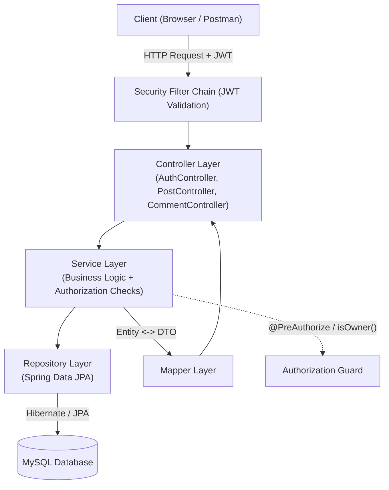

<div align="center">

# 🚀 Blog Backend API

**A secure, robust RESTful API for a blogging platform built with Java, Spring Boot, and Spring Security.**

[](https://www.oracle.com/java/)
[](https://spring.io/projects/spring-boot)
[](https://jwt.io/)
[](https://www.mysql.com/)
[](https://opensource.org/licenses/MIT)

</div>

---

## 📌 Overview
A production-ready backend application designed to handle blog posts, user comments, and secure authentication following a clean layered architecture. 

### ✨ Key Features
* **Secure Authentication & Authorization:** Implemented using Spring Security and JSON Web Tokens (JWT).
* **DTO & Mapper Pattern:** Utilized Data Transfer Objects (DTOs) to decouple the database entities from API request/response payloads, ensuring secure and clean data transfer using dedicated Mappers.
* **Data Validation:** Robust request payload validation using Jakarta Bean Validation (`@Valid`, `@NotNull`, `@Size`, etc.).
* **Pagination & Sorting:** Efficient data retrieval for posts and comments using Spring Data JPA `Pageable`.
* **Relational Database:** MySQL persistence with proper entity mappings and relationships.

---

## 🔌 API Endpoints Reference

### 🔐 Login & Auth Module
* `POST /api/auth/register` : Register a new user account
* `POST /api/auth/login` : Authenticate user with valid credentials & return JWT token
* `POST /api/auth/logout` : Logout user based on session token
---

## 🔌 API Endpoints Reference

### Posts Module
* `GET /api/posts` : Retrieve all blog posts
* `POST /api/posts/user` : Create a new post *(Auth Required)*
* `PUT /api/posts/update/{postId}` : Update an existing post *(Auth Required)*
* `DELETE /api/posts/delete/{postId}` : Delete a post *(Auth Required)*

### Comments Module
* `GET /api/comments/post/{postId}` : Get all comments for a specific post
* `POST /api/comments/post/{postId}/user` : Add a comment to a post *(Auth Required)*
* `DELETE /api/comments/{id}` : Delete a comment *(Auth Required)*

---

## ⚙️ Quick start

### 1. Clone the repository:
 ```bash
 git clone [https://github.com/tamer4-4/blog-backend.git](https://github.com/tamer4-4/blog-backend.git)
 cd blog-backe
  ```

### 2. Configure your local database in `application.properties`:
```properties
spring.datasource.url=jdbc:mysql://localhost:3306/NameDB
spring.datasource.username=root
spring.datasource.password=YOUR_PASSWORD
```

## 🏗️ Architecture

The application follows a classic **layered architecture**, separating concerns between request handling, business logic, and data persistence.



### Layer Responsibilities

| Layer | Responsibility |
|---|---|
| **Security Filter Chain** | Intercepts every request, validates the JWT, and populates the `Authentication` context before it reaches any controller. |
| **Controller** | Receives HTTP requests, delegates to the Service layer. Contains no business logic. |
| **Service** | Contains business rules, ownership checks (`isOwner`), and orchestrates calls to the Repository. |
| **Repository** | Spring Data JPA interfaces responsible for database access. |
| **Mapper** | Converts between `Entity` objects and `DTO`s, so the database structure is never exposed directly in API responses. |

---

## 🔒 Security Improvements

### 1. Prevented Role Self-Assignment (Privilege Escalation Fix)
** لاحظت ونا براجع ان الريكوست بيكون فيه ال role ودا كان خطاء لان كدا اى حد يقدر يحط نفسة ادمن عادى واكتشفت كمان ان دا خطاء مشهور اصلا اسمه Privilege Escalation **

**Problem:** The `/api/auth/register` endpoint originally accepted a `role` field directly from the client request body, allowing any user to register themselves as `ROLE_ADMIN`.

**Fix:** The server now always assigns `ROLE_USER` by default on public registration. Role elevation is only possible through a separate, protected endpoint restricted to existing admins via `@PreAuthorize("hasRole('ADMIN')")`.


### 3. User Identity Always Derived from the JWT, Never from the Request Body

All actions that depend on "who is performing this" (creating a post, deleting a comment, etc.) extract the username from the authenticated `Authentication` object rather than trusting a `userId`/`username` field sent by the client.

---

## 🧱 Standardized API Responses

All endpoints now return a consistent response envelope instead of mixing raw strings and raw objects.

### `ApiResponse<T>`

```java
public class ApiResponse<T> {
    private boolean success;
    private String message;
    private T data;
    private long timestamp;

    public static <T> ApiResponse<T> success(String message, T data) {
        return new ApiResponse<>(true, message, data);
    }

    public static <T> ApiResponse<T> success(String message) {
        return new ApiResponse<>(true, message, null);
    }

    public static <T> ApiResponse<T> error(String message) {
        return new ApiResponse<>(false, message, null);
    }
    // constructor + getters omitted for brevity
}
```

### Example Response Shape
```json
{
  "success": true,
  "message": "Post created successfully",
  "data": { "id": 12, "title": "..." },
  "timestamp": 1234567890
}
```

---

## ✅ Suggested Next Steps

- [ ] Move `application.properties` secrets (`jwtSecret`, `spring.datasource.password`) to environment variables
- [ ] Add rate limiting on `/api/auth/login`
- [ ] Add JUnit + Mockito tests for `PostService` (including `isOwner` edge cases)
- [ ] Clarify JWT logout behavior (client-side token discard vs. server-side blacklist)

